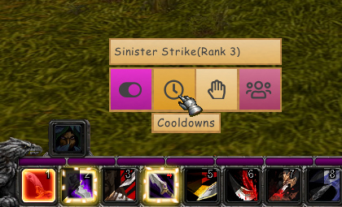

# 💡 LightRotations - SoD

[](https://github.com/ferib/LightRotations/actions/workflows/master.yml)

[LightRotations](https://github.com/ferib/LightRotations) is a combat rotations framework based on [DarkRotations](https://gitlab.com/dark_rotations).



## Summary
The purpose of the framework is similar to something like WeakAuras2 as its goal is to enhance your combat gameplay, but it does so in a unique way. LightRotations allows you to easily create 'class profiles' aka '[combat rotations](./rotations/)' for a given class or spec, these combat rotations can then be used to assist you during your gameplay.

### Example Use


The UI prompts which spells to cast in the UI as well as highlight the spells in your action bars _(if found, does __not work with macros!__)_

## in-game commands

```
/dr move		Locks and unlocks the button frame for moving
/dr econf		Shows the core engine config window
/dr load x		Loads the specified rotation name x
/dr help		Display the list of known commands
/dr list		List available rotations
/dr toggle x	Toggles the on/off state of the specified button name x
/dr debug lvl	Enable the debug console at the specific debug level (0-6)
/dr size		Adjusts the size of the on-screen buttons/UI
```

## ⚔️ Combat Rotations

The current rotations included are a work in progress as I only recently picked TBC back up, however, I tend to update these as I go.

| Name | Class | Type | Dev | Status |
|------|-------|------|-----|--------|
| `druid` | Druid | SoD 25 | [ferib](https://github.com/ferib) | 🟢 Balance SoD |
| `hunter` | Hunter | | | 🔴 TODO |
| `mage` | Mage | | | 🔴 TODO |
| `paladin` | Paladin | | | 🔴 TODO |
| `priest` | Priest | 25 SoD | [ferib](https://github.com/ferib) | 🟠 Lvl 20 Holy? SoD |
| [Rogue](rotations/rogue/rogue.lua) | Rogue | Basic | [ferib](https://github.com/ferib) | 🟠 Lvl 1-10 |
| `shaman` | Shaman | | | 🔴 TODO |
| `resto` | Shaman | SoD 25 | [ferib](https://github.com/ferib) | 🟢 Lvl 25 Restoration SoD |
| `ele` | Shaman |  SoD 25 | [ferib](https://github.com/ferib) | 🟢 Lvl 25 Elemental SoD |
| ~~Warlock~~ | Warlock | Basic | [ferib](https://github.com/ferib) | 🔴 TODO _(58+ leveling build)_ |
| ~~[Dotlock](./rotations/warlock/)~~ | ~~Warlock _(affliction)_~~ | ~~Advanced~~ | [ferib](https://github.com/ferib) | ~~🟢 Lvl 80~~ |
| `warrior` | Warrior | | | 🔴 TODO |


# ℹ How to install

[Download as .zip](https://github.com/ferib/LightRotations/archive/refs/heads/master.zip) and extract in `C:\Program Files (x86)\World of Warcraft\_classic_\Interface\AddOns\Light`, make sure the folder no longer has the `-master` suffix in the name and that it is correctly renamed to `Light`.

NOTE: your default installation folder might be located elsewhere!

-- OR --

Advanced installation for git users:

```bash
cd C:\Program Files (x86)\World of Warcraft\_classic_\Interface\AddOns\
git clone https://github.com/ferib/LightRotations Light
cd Light
git checkout classic_era
```

### 🔐 PROTECTED Lua and Vanilla Wow
Wow introduced protected Lua somewhere around patch 2.x, __LightRotations does NOT support PROTECTED Lua APIs__, however, we provide a way to [downgrade to Vanilla Wow](./docs/vanilla_wow.md).


## ⚠ Warning: AddOn Name Detection
It is public knowledge that AddOn names are uploaded to the game server for analysis! Both folder/toc names *(`Light`, `Light.toc`)* and Lua globals `_G.Light` may be tracked.

# ✍ Getting Started: Writing Combat Rotations

To get started creating combat rotations, check out the [docs](docs/readme.md).
