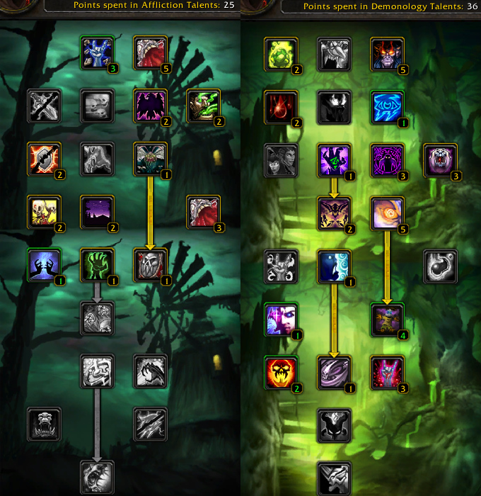

# Warlock Rotations (TBC)

- [Warlock Rotations (TBC)](#warlock-rotations-tbc)
	- [Dotlock](#dotlock)
		- [Buttons](#buttons)
		- [Modifiers](#modifiers)
		- [Talent Tree](#talent-tree)
	- [Warlock Lvl 58-70](#warlock-lvl-58-70)

## Dotlock

Level 70 Warlock with AoE dot spams.

### Buttons
- __Cooldowns__ Enable Drain Life to manage hp/mama
- __Interrupts__ Enables Siphon Life
- __Multi-target__ Enables dotting nearby players
- __Auto Curse of Agony__ Enables Curse of Agony
- __Auto Corruption__ Enables Corruption

With the right talent tree, Corruption & Curse of Agony will give chance to proc 'Shadow Trance', instant Shadowbolt. When Shadow Trance is active we scan for nearby enemies below x % health and go for the kill.

Drain Life & Siphon Life is used to keep mana up as Life Tap is used somewhere at >98% hp.

Multi-target, Dot any nearby, is used to make damage meter go brrrrr.

### Modifiers

Force actions while holding down the below modifers:

- __Alt__ Cast Fear
- __Shift__ Drain Life

### Talent Tree

## Warlock Lvl 58-70

TODO: figure out what specs I used here, can't remember but I used Lifetap + Drainlife and enhanced it with a talent tree
